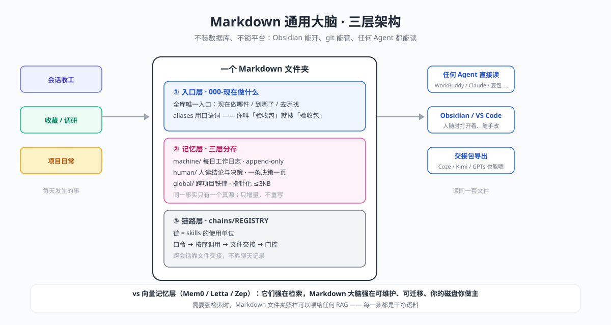

<div align="center">

# one-person-studio

**A one-person animation studio: the battle-tested pipeline of making a full animation series alone with AI agents, distilled into 27 installable Agent Skills**

*3 original IPs · 5 episodes shipped · 30+ field-tested rules*

简体中文 | [English](README.en.md)

</div>

---

## What is this

This is not a tutorial collection. It is a **production pipeline that actually ran and is still running**.

One person + AI agents: 3 original animation IPs, 5 finished episodes, no human crew. Every pitfall along the way — how long a prompt should be, what the silence-detection threshold should be, which jobs belong to a video model and which never do — has been distilled into 27 skills.

It grew out of field-tested rules like these:

> "Style transfer ('*looks like that kind*') is what AI is good at; character reproduction ('*is that exact one*') is not" — concluded from a 30s cross-shot test, 5/5 shots passing.
>
> "Transitions placed by feel were actually off by +273 / −381 / −108 ms" — so beat-matching must be computed before cutting.
>
> "The silence threshold −50 dB is a measured value; my guess of −40 got corrected."

Every rule comes from footage that actually ran. That is the difference between this repo and "AI video tutorials".

## What it solves

| Situation | What you get |
| --- | --- |
| You want to make an animated series, alone | A validated pipeline: project → production → QA → publish, one skill per workstation |
| Your character morphs every other shot | Character-consistency formulas + the reference-image stacking method (six frames, zero drift) |
| A dozen prompt versions and still gambling | A/B-tested answers: 872-char structured vs 159-char one-liner, results and reasons documented |
| Episode done, unsure if it can ship | `ep-qa` machine check: aspect ratio / duration / loudness / black frames — measurable facts only, no aesthetics |
| 500 bookmarks, none of them used | Bookmark mining + benchmark deconstruction + replication-run skills, as a set |
| New AI tools dropping weekly, should you care? | `new-tool-triage`: a four-way fork — use as-is / extend / wrap / re-implement (with attribution) |

## Quick start

```text
/ops I want to make an animated series, but I'm alone. Where do I start?
```

`/ops` is the production manager: it listens to your situation, figures out which workstation you're stuck at, dispatches the right skill, and hands you the next prompt to send.

Or call a specific skill directly:

```text
/ops-agnes-video-prompt   Write a character-locked long prompt for me
/ops-ep-qa                Check these three episodes: aspect ratio, black frames, silent gaps
/ops-character-ip         Build an archive for my character: refs, turnsheets, consistency rules
```

## Install

```bash
npx -y skills add sethliao/one-person-studio -g --all
```

Manual:

```bash
git clone https://github.com/sethliao/one-person-studio.git /tmp/ops-studio \
  && cp -r /tmp/ops-studio/skills/* ~/.claude/skills/ \
  && rm -rf /tmp/ops-studio
```

## 🔧 Point it at your vault (`VAULT_PATH`)

These skills were written against the author's Obsidian vault. Anything that reads **files inside the vault**
uses the placeholder **`$VAULT_PATH`** — point it at your own vault:

```bash
# Option 1: export an env var (recommended — scripts expand it automatically)
export VAULT_PATH="$HOME/Documents/your-vault"

# Option 2: replace it globally after install (if you don't set the env var)
grep -rl '$VAULT_PATH' ~/.claude/skills/ | xargs sed -i '' "s|\$VAULT_PATH|$HOME/Documents/your-vault|g"
```

**Skills that need it**: `agnes-video-prompt` · `x-bookmarks-mining` · `design-codex` · `behance-case-deck` ·
`ep-qa` · `drama-claw-hermes` · `social-media-archive` · `new-tool-triage` · `ai-handover-pack` ·
`content-research-board` · `agent-skills-bridge`.

Everything else works without it — vault-dependent skills simply skip or warn when the path is missing.

## Skill map

| Workstation | Skills | What they do |
| --- | --- | --- |
| Router | `ops` | Listen, dispatch, hand over the next prompt |
| Project | `character-ip` · `content-strategy` | Character IP archive & consistency · topic & show design |
| Production | `agnes-video-prompt` · `h3-prompt-writing` · `drama-episode-automation` · `design-codex` · `drama-claw-hermes` | Prompt writing (two channels) · brief-to-episode · design codex · local pipeline |
| QA | `ep-qa` | Measurable delivery facts only |
| Research | `content-research-board` · `behance-research` · `behance-replicate-run` · `x-bookmarks-mining` · `social-account-diagnosis` · `studio-site-teardown` | Platform research · benchmark deconstruction · account diagnosis |
| Publish | `behance-case-deck` · `social-media-archive` · `ai-handover-pack` · `library-pull` | Portfolio decks · social archive · handover packs |
| Business | `b2b-anchor-proposal` | Conference & platform partnership proposals |
| Workflow | `frame` · `new-tool-triage` · `obsidian-auto-context` · `obsidian-plan-workflow` · `agent-skills-bridge` · `mcp-server-verify-mount` | Start/end-of-day · tool triage · session memory · skills bridging · MCP verify |

Full catalog with examples: [新手入门 (Chinese)](docs/新手入门.md) · Field rules: [实测判据 (Chinese)](knowledge/实测判据.md)

## Your agent needs a brain

The second pillar of this pipeline: **a plain Markdown folder as the memory of every agent**. No vector database, no platform lock-in — Obsidian opens it, git tracks it, WorkBuddy / Claude Code / Codex / Doubao all read the same files.

Three layers: an **entry layer** (one `000-` page answering "what now", with colloquial aliases), a **memory layer** (machine daily logs / human conclusions / global rules, pointer-thin), and a **chain layer** (a registry wiring skills into pipelines: passphrase → ordered calls → file handoff → gates).

Methodology and field rules: [docs/通用大脑.md (Chinese)](docs/通用大脑.md)



## Author

**Seth Liao** · 3D Generalist / one-person studio owner
[GitHub](https://github.com/sethliao) · Business & licensing: [sethliaoartist@gmail.com](mailto:sethliaoartist@gmail.com)

## License

[CC BY-NC 4.0](LICENSE) — free for personal learning and creation with attribution; commercial use requires permission from the author.
