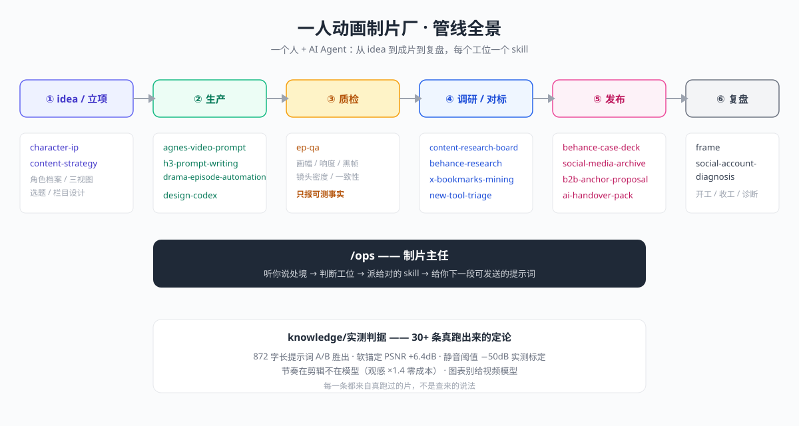

<div align="center">

# one-person-studio

简体中文 | [English](README.en.md)

**一人动画制片厂：把「一个人 + AI 做出整季动画」的实战管线，沉淀成 26 个可直接调用的 Agent Skills**

*3 个原创 IP · 5 集成片 · 30+ 条实测判据 · 0 帧抽卡玄学*

[](VERSION)
[](LICENSE)
[](skills/)

**支持：WorkBuddy、Claude Code、豆包、Codex，以及其他支持 Skills 的 Agent。**

[快速开始](#快速开始) · [安装](#安装) · [能力一览](#能力一览) · [实测判据](#这条管线验证过什么) · [新手入门](docs/新手入门.md)

</div>

---

## 这是什么

这不是教程合集，而是一条**真实跑过、还在跑**的动画生产管线。

一个人 + AI Agent 协作：3 个原创 IP，5 集动画成片，从 idea 到成片到发布全流程没有第二个「人类员工」。生产中踩过的每一个坑——提示词写多长效果最好、静音判定阈值该设多少、哪些活该交给视频模型哪些打死不能交——都被沉淀成了 26 个 skill。

**它的前身是一条条的实测记录：**

> 「风格迁移（*像那一类*）AI 很行；角色还原（*就是那一个*）不行」——分工定论，来自 30 秒跨镜实测 5/5 成立
>
> 「凭感觉排的转场实际偏了 +273 / −381 / −108 ms」——所以卡点必须先算再剪
>
> 「静音阈值 −50dB 是实测标定值，我拍 −40 被纠正过」——所以 ep-qa 只报可测事实

每一条判据都来自真跑过的片，不是查来的说法。这就是这个仓库和「AI 视频教程」的区别。

## 它解决什么问题

| 真实处境 | 你会得到 |
| --- | --- |
| 想做动画/系列视频，但只有你一个人 | 一整条被验证过的生产管线：立项→生产→质检→发布，每个工位都有 skill 接手 |
| 角色每换一个镜头就「变脸」 | 角色一致性公式 + 参考图叠加法（六帧零漂移的实测配置） |
| 提示词写了十几版都在抽卡 | A/B 实测过的写法：872 字三段式 vs 159 字一段式，胜负和原因都写明 |
| 片子做完了，不确定能不能发 | `ep-qa` 机器体检：画幅/时长/响度/黑帧/镜头密度，只报可测事实，不判审美 |
| 收藏夹里 500 个参考，一个都没用上 | 收藏挖掘 + 对标拆解 + 复刻跑通的成套 skills |
| 每次开会话都要重新解释一遍项目背景 | 一套 Markdown 通用大脑：任何 agent 都能读的记忆结构，人也能读 |
| 新 AI 工具一个接一个出，不知道跟不跟 | `new-tool-triage` 四选一：只用/扩展/包装/抄，抄必署名，不重复造轮子 |

## 快速开始

安装后，对 Agent 直接说：

```text
/ops 我想做一部系列动画，但只有我一个人，该从哪开始？
```

`/ops` 是制片主任：它听你说处境，判断你卡在哪个工位，把活派给对的 skill，并给你一段可以直接继续发送的提示词。

已经知道要什么时，直接调用具体 skill：

```text
/ops-agnes-video-prompt 帮我写一个锁定角色一致性的长提示词
/ops-ep-qa 体检一下这三条成片，画幅一致吗、有黑帧吗、有静音段吗
/ops-character-ip 给我的角色建一套档案：参考图、三视图、一致性规则
/ops-universal-brain 把我的笔记文件夹变成所有 agent 都能读的大脑
/ops-new-tool-triage 我看到一个新的 AI 视频工具，帮我判断要不要投入
```

## 安装

### 一行安装（推荐）

```bash
npx -y skills add sethliao/one-person-studio -g --all
```

### 手动安装

```bash
git clone https://github.com/sethliao/one-person-studio.git /tmp/ops-studio \
  && cp -r /tmp/ops-studio/skills/* ~/.claude/skills/ \
  && rm -rf /tmp/ops-studio
```

## 能力一览

| 工位 | 主要入口 | 干什么 |
| --- | --- | --- |
| **总入口** | `/ops` | 读处境、派活、给下一步提示词 |
| **立项** | `character-ip` · `content-strategy` | 角色 IP 档案与一致性 · 选题与栏目设计 |
| **生产** | `agnes-video-prompt` · `h3-prompt-writing` · `drama-episode-automation` · `design-codex` · `drama-claw-hermes`¹ | 视频提示词写作（双通道）· 一 brief 一集 · 设计契约去 AI 味 · 本地管线 |
| **质检** | `ep-qa` | 画幅/时长/响度/黑帧/镜头密度/系列一致性，只报可测事实 |
| **调研** | `content-research-board` · `behance-research` · `behance-replicate-run` · `x-bookmarks-mining` · `social-account-diagnosis` · `studio-site-teardown` · `video-prompt-reverse`² | 平台调研 · 对标拆解 · 收藏挖掘 · 账号诊断 · 提示词反推 |
| **发布** | `behance-case-deck` · `social-media-archive` · `ai-handover-pack` · `library-pull` | 作品集案例页 · 社媒归档 · 知识库交接打包 |
| **商务** | `b2b-anchor-proposal` | 会议/大会/平台 To B 合作提案 |
| **大脑** | `universal-brain`² · `obsidian-auto-context` · `obsidian-plan-workflow` · `ai-handover-pack` · `library-pull` | Markdown 通用大脑 · 会话自动沉淀 · 计划落库 · 平台交接包 · 云端拉回 |
| **工作流** | `frame` · `new-tool-triage` · `agent-skills-bridge` · `mcp-server-verify-mount` | 开工收工 · 新工具四选一 · skills 桥接 · MCP 验证 |

> ¹ `drama-claw-hermes` 依赖本地部署的视频管线，属于进阶工位，装不装不影响其他 skill。
> ² 

完整目录、适用时机和输入示例见 [新手入门](docs/新手入门.md)。

## 你的 Agent 需要一个大脑

这条管线的另一根支柱：**用 Markdown 文件夹当所有 Agent 的记忆**。不装向量数据库、不锁任何平台——Obsidian 能开、git 能管、WorkBuddy / Claude Code / Codex / 豆包 读同一套文件。

三层结构：**入口层**（000- 开头的「现在做什么」页，aliases 用口语词，搜得到点得动）→ **记忆层**（machine 每日日志 / human 人读结论 / global 跨项目铁律，指针化瘦身）→ **链路层**（chains 注册表：口令 → 按序调 skills → 文件交接 → 门控）。

完整方法论 + 实战纪律 + 与 Mem0/Letta 类记忆层的对比 → [docs/通用大脑.md](docs/通用大脑.md)

## 这条管线验证过什么

从 30+ 条实测判据里挑五条最值钱的（完整版见 [knowledge/实测判据.md](knowledge/实测判据.md)）：

1. **分工定论**：画风/场景/氛围交给 AI，角色表演本体交给 3D 渲染，叙事节奏自己写——各干各的强项。
2. **参考图叠加法**：角色 ref 保身份 + 风格 ref 保色板，互不干扰。还原度 ≈ 参考图质量 × 角色辨识度 ÷ 改动幅度。
3. **872 字胜过 159 字**：A/B 实测，三段式长提示词（含逐段正向/反向）在角色一致性上完胜短提示词。
4. **节奏在剪辑里，不在模型里**：静帧推镜 + 二次构图 + 硬切，素材观感放大 1.4 倍，成本零增加。
5. **图表别给视频模型**：它会写错字而且不可改。文字/图表类镜头走 HTML 渲染，可改可复用可重跑。

## 管线全景



## 作者

**Seth Liao（廖志朋）** · 三维艺术家 / 一人制片厂厂长
[GitHub](https://github.com/sethliao) · [B站](https://space.bilibili.com) · 商业合作与授权：[sethliaoartist@gmail.com](mailto:sethliaoartist@gmail.com)

## 许可证

[CC BY-NC 4.0](LICENSE) —— 个人学习与创作自由使用，衍生作品请注明来源；商业用途需授权，联系作者。
